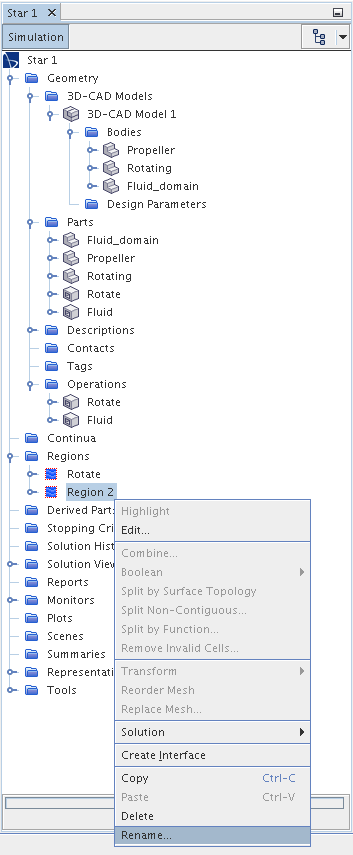

# Modeling Unsteady Transient Propeller Flow in StarCCM+

Summary
1. Setup
2. Define Geometry
2. Define Physics Continua
3. Create Mesh
4. Run simulation
5. Visualization

## Setup
### Opening StarCCM+
#### Mac Mini (must have supercomputer account)
1. Open Terminal
2. `ssh -X username@ssh.fsl.byu.edu`
3. Enter Password
4. `module load starccm+/11.04.010`
5. `starccm+`

#### WorkStation (Locally)
1. Open Terminal
2. `cd ~/Programs`
3. `./openstar.sh`

### Creating New simulation
1. Ctrl + N
2. Click "Parallel on Local Host"
3. Set "Compute Processes: " to 8 (depends on system availability/specs)

4. Click "OK"
5. Save simulation

## Defining Geometry
For this example we will use a APC 9x4.5 (0.2286 m diameter) propeller where the domain and CAD model dimensions are based upon the best practices recommendations found on [StevePortal](https://documentation.thesteveportal.plm.automation.siemens.com/starccmplus_latest_en/index.html?param=Vww8R&authLoc=https://thesteveportal.plm.automation.siemens.com/AuthoriseRedirect#page/STARCCMP%2FGUID-CE924D58-F9EE-4029-ABAF-B3DC4436F548%3Den%3D.html%23) (Username: byustarccm@gmail.com; Password: NACA0012cougar!) under Simcenter STAR-CCM+ > Simulating Physics > Guidelines for Applying Simcenter STAR-CCM+ > Guidelines for Aerodynamics Calculations.

[comment]: <> (* "Use a hexahedral or "bullet-shaped" far-field boundary, with domain extents around 8–10 body lengths from the body.")

### Create New CAD Model
In Simulation Tree:
1.  Right Click on Geometry > 3D-CAD Models and select "New"

### Import and Orient Existing Propeller Geometry (IGS file)
In 3D-CAD Tree:
1. Right Click 3D-CAD Model 1 and select Import > CAD Model
 
3. Right click on body and select Transform > Rotate

4. Rotate body so that X+ will be in the free stream direction (for simplicity later)

### Create a Puck Around Propeller for Rotation

1. Right click XY under Features and select "Create Sketch"

2. Select "Create Rectangle"  and then click and drag on the XY sketch plane to create an arbitrary rectangle

3. Now click on each line and edit the start and end points under the Line Properties section so that the rectangle corners are at [(0.02, 0), (-0.02, 0), (0.02, 0.12), (-0.02, 0.12)]

4. Right click Sketch 1 in the tree and select "Create Revolve"

5. Change the Angle to 360 deg and change Body Interaction to "None", then press OK

6. To check, select "Make Scene Transparent" along the top bar and your model should look like the following:

### Create Fluid Domain
1. Right click on XY and "Create Sketch"
2. Create the following geometry

  * These dimensions and shapes are based on recommendations found on StevePortal:
      * "Use a hexahedral or "bullet-shaped" far-field boundary, with domain extents around 8–10 body lengths from the body."
        * For our case we will use the propeller radius instead of diameter to minimize computational time
3. Right click Sketch 2 in the tree and select "Create Revolve"
4. Change the Angle to 360 deg and change Body Interaction to "None", then press OK

### Naming Bodies/Surfaces
1. Right click on each Body in the 3D-CAD tree and select rename. Rename them as listed below:

    * Body 1 -> Propeller
    * Body 2 -> Rotating
    * Body 3 -> Fluid_domain.
    
2. Right click on a face of the rotating puck in the 3D-CAD View 1 and select "Rename". Rename as "Rotating"

3. Repeat for the other two faces of the puck, and name them each "Rotating"
4. Name each of the faces of the fluid domain as indicated below.

1. Close 3D-CAD

### Define Domains

In the simulation tree:
2. Right click on Geometry > 3D-CAD Model 1 > Bodies > Propeller and select "New Geometry Part"
3. For the Propeller only, select "Very Fine" for Tessellation Density.
On all other parts leave all options on the defaults. Select okay

3. Repeat for Rotating and Fluid_domain
2. Right click Geometry > Operations and select New > Subtract

3. Set the options as shown, and mark "Execute Operation Upon Creation"

4. Create another Subtract as shown

5. Right click on Geometry > Parts > Subtract and select "Rename"
    * Subtract -> "Rotate"
    * Subtract2 -> "Fluid"
6. Right click on Geometry > Operations > Subtract and select "Rename"
    * Subtract -> "Rotate"
    * Subtract2 -> "Fluid"
7. Right click Geometry > Parts > Rotate and select "Assign Parts to Regions..."

8. Select "Create a Boundary for Each Part Surface"
9. Repeat for Fluid
10. Right click Regions > Region and rename to "Rotate"
11. Right click Regions > Region 2 and rename to "Fluid"

### Designate Boundary Conditions and Interfaces

## Define Physics Continua

## Create Mesh

## Run simulation
* Super Computer

## Visualization
